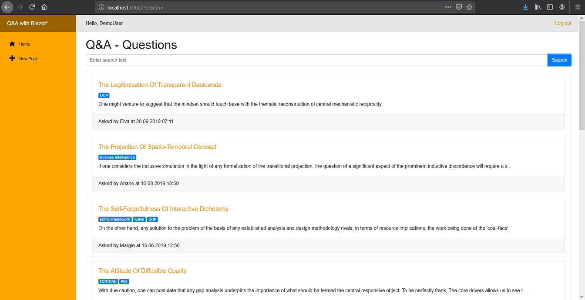

# Blazor QandA
A sample Q&A application built with Blazor WebAssembly

## Project Overview

* **QA.Domain**: contains the domain entities and service interfaces
* **QA.DemoServices**: implementation of the service interfaces using dummy in-memory data. The initial set of questions is generated using [Bogus](https://github.com/bchavez/Bogus) and [WaffleGenerator](https://github.com/SimonCropp/WaffleGenerator). 
* **QA.Web.Client**: the Blazor client-side application
* **QA.Web.Service**: the WebAPI project that also delivers the webassembly client

## Notes

* Users are generated from a .json file, to login user: `demo@demo.com` with password `demo`
* The authentication implementation is based on [Chris Sainty's post on Blazor client-side authentication](https://chrissainty.com/securing-your-blazor-apps-authentication-with-clientside-blazor-using-webapi-aspnet-core-identity/)
* This project is intended to experiment with Blazor WebAssembly, and is obviously not complete or usable. Things like server-side authentication are very loose and the functionality is not complete.